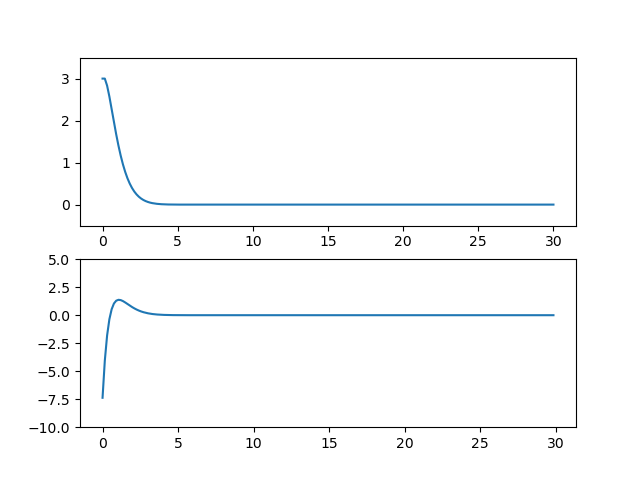
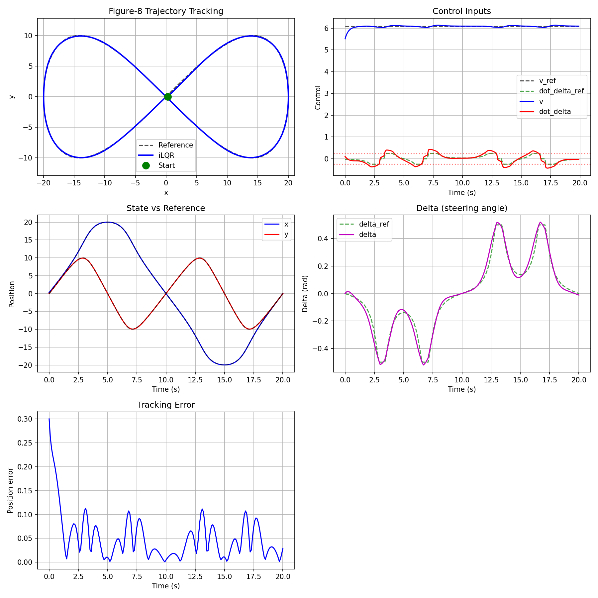

# iLOR(iterative linear quadratic regulator)
iLOR(iterative linear quadratic regulator) is a variant of the LQR(linear quadratic regulator) method for application in nonlinear dynamic system. This project provides:
- Example of UFO Rotation Control
- Example of Vehicle Driving Control
- Full documentation of LQR and iLQR

All code is implemented by GPT agent.

## Gallery
### UFO Rotation Control
**Overview Video:** [UFO Rotation Control (youtube)](https://www.youtube.com/watch?v=E_RDCFOlJx4)

**Overview Video:** [UFO Rotation Control (bilibili)](https://www.bilibili.com/video/BV1bF41197HJ/?spm_id_from=333.1391.0.0&vd_source=5d69ac08bd10beeee8c1070d4d354bed)

### Vechicle Driving Control

## Specification
* Language: Python3.10
* lqr.py: Implementation of the LQR algorithm, which is specified in linear-quadratic-regulator.pdf
* ilqr.py: Implementation of the iLQR algorithm, which is specified in iterative-linear-quadratic-regulator.pdf
* ilqr_vehicle_model.py: Application of iLQR to vechie model, with additional specification vehicle_model.pdf
* implement_request_prompt_xxx.md: Code implementation request prompt